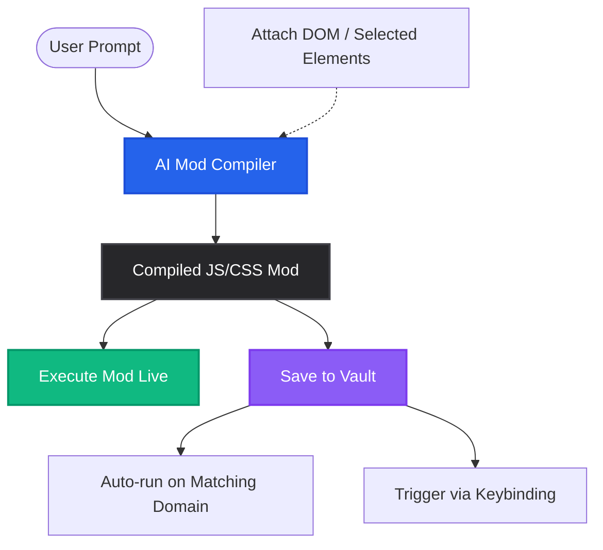

<p align="center">
  
</p>

<h1 align="center">🔮 AutoMage</h1>

<p align="center">
  <strong>AI-powered web automation, macros, and live page modding – directly in your browser.</strong>
</p>

<p align="center">
  <a href="https://github.com/waleed-tahir/AutoMage/stargazers"></a>
  <a href="https://github.com/waleed-tahir/AutoMage/network/members"></a>
  
  
</p>

---

## 🚀 What is AutoMage?

**AutoMage** is a lightweight, local developer tool that transforms how you interact with the web. It combines **LLM-based script generation**, **macro recording**, and an **interactive element selector** to let you programmatically modify, automate, and script web pages instantly. 

No more writing boilerplate userscripts or fighting selectors in Chrome DevTools. Just ask the AI what you want to automate, grab the elements, and run it.

---

## ✨ Key Features

### 🧠 1. AI Mod Compiler
* **Natural Language to Script**: Type prompts like *"Make the background dark"* or *"Extract this table and download as a CSV"*, and watch the extension compile executable JS/CSS.
* **Context-Aware DOM Injection**: Toggle **Attach DOM** to feed the page structure directly to the LLM, giving it full visibility of the active website.
* **Instant Execution**: Test your compiled scripts on the fly with a single click.

### 🎯 2. Advanced Element Grabber
* **Precision Magnetic Selection**: Hover and select specific elements to feed as prompt context, bypassing noisy page content.
* **DOM Tree Refinement**: Move up and down the DOM tree with visual **↑ Parent** and **↓ Child** refiner buttons.
* **Multi-Instance Grabber**: Click **⚭ Similar** to dynamically analyze class names and auto-select all corresponding elements on the page.
* **Theme Isolation**: Built inside a Shadow DOM, the grabber maintains a sleek dark-zinc theme, isolated from host page styles.

### 🔴 3. Macro Recorder & Playback
* **Interactive Recording**: Record clicks, keystrokes, and scroll events. A floating indicator monitors your actions step-by-step.
* **Prerecorded Replay**: Save recorded interactions as macros to repeat complex workflows or test UI layouts automatically.

### 🛡️ 4. The Script Vault
* **Auto-Run**: Configure match patterns/domains to run scripts automatically when pages load (`run-at: document-idle`).
* **Custom Keybindings**: Map shortcuts to trigger automation sequences instantly.
* **LLM Assisted Modification**: Modify existing scripts in the Vault using prompts and the Element Grabber, without leaving your editor.

### 🔌 5. Pluggable AI Engine
* Supports popular LLM providers out of the box: **Groq** (default), **OpenAI**, **Anthropic (Claude)**, **Grok**, and local **Ollama** models.

---

## 🗺️ System Flow



---

## 🛠️ Installation

AutoMage runs as a local Chrome Extension in developer mode. 

### Prerequisites
* [Node.js](https://nodejs.org/) (v18+)
* [npm](https://www.npmjs.com/)

### Step-by-Step Setup
1. Clone the repository:
   ```bash
   git clone https://github.com/waleed-tahir/AutoMage.git
   cd AutoMage
   ```
2. Install dependencies:
   ```bash
   npm install
   ```
3. Build the extension:
   ```bash
   npm run build
   ```
   *This generates a production-ready `dist` folder.*
4. Load it in Chrome:
   * Open Google Chrome and navigate to `chrome://extensions/`.
   * Enable **Developer mode** (top-right toggle).
   * Click **Load unpacked** (top-left button).
   * Select the **`dist`** folder inside the project directory.

---

## 📖 How to Use

### 1. Compile your first Script
1. Click the **AutoMage** extension icon in your toolbar.
2. Select your AI provider in the **Settings** tab and input your API key.
3. In the **Studio** tab, click **Select Elements**, select the relevant page components, and click **Finalise**.
4. Type your instruction in the text area (e.g. *"Click this button every 5 seconds"*).
5. Click **Compile & Preview Script**, review the output, and click **Run Mod** to test!

### 2. Save and Automate
1. When you have a working script, click **Save Mod to Vault**.
2. Go to the **Vault** tab, find your script, and click **Edit**.
3. Add a matching URL pattern (e.g. `https://example.com/*`) and click **Update Script**.
4. Now, the script will execute automatically every time you visit that site!

---

## ⚙️ Supported Providers

| Provider | Model | Setup |
| :--- | :--- | :--- |
| **Groq (Fastest)** | Llama 3.3 | Add your API key in settings. |
| **OpenAI** | GPT-4o / GPT-4o-mini | Add your API key in settings. |
| **Anthropic** | Claude 3.5 Sonnet | Add your API key in settings. |
| **Grok** | Grok Beta | Add your API key in settings. |
| **Ollama (Local)** | Llama 3 / Qwen 2.5 | Set up Ollama on `localhost:11434`. |

---

## 🤝 Contributing

Contributions are what make the open source community such an amazing place to learn, inspire, and create. Any contributions you make are **greatly appreciated**.

1. Fork the Project
2. Create your Feature Branch (`git checkout -b feature/AmazingFeature`)
3. Commit your Changes (`git commit -m 'Add some AmazingFeature'`)
4. Push to the Branch (`git push origin feature/AmazingFeature`)
5. Open a Pull Request

---

## 📄 License

Distributed under the MIT License. See `LICENSE` for more information.

<p align="center">Developed with 💜 for web developers and power users.</p>
