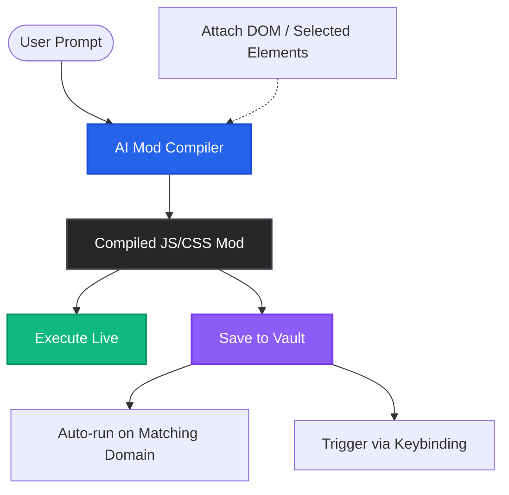

<div align="center">
  
  
  # 🔮 AutoMage
  
  **The AI-Powered Web Automation Studio Built Directly Into Your Browser.**

  <p align="center">
    <a href="https://github.com/waleed-tahir/AutoMage/stargazers"></a>
    <a href="https://github.com/waleed-tahir/AutoMage/network/members"></a>
    
    
    
  </p>
  
  <h3>Stop fighting selectors and boilerplate. Let AI automate the web for you.</h3>
</div>

---

## 🚀 Why AutoMage?

Writing browser automation scripts, Tampermonkey mods, or scraping tools is traditionally tedious—finding the right DOM selectors, dealing with dynamic classes (React/Tailwind), and testing edge cases takes hours.

**AutoMage** changes everything. It combines **LLM-based script generation**, **magnetic element grabbing**, and a **macro recorder** into a seamless local developer tool. Just point, click, and ask the AI what you want to do.

Whether you want to restyle a messy website, extract a hidden table, or automate a boring repetitive task—AutoMage compiles and executes it *instantly*.

---

## ✨ Features That Feel Like Magic

### 🧠 AI Mod Compiler
* **Natural Language to Code:** Type a prompt like *"Extract all pricing tiers into a CSV"* or *"Make the background dark and the text readable"*. AutoMage compiles executable JS/CSS instantly.
* **Smart DOM Vision:** Toggle **Attach DOM** to feed the exact page structure directly to the AI, allowing it to write perfectly targeted selectors for React/Vue/Tailwind apps.
* **Instant Live Preview:** Test compiled scripts on the fly with a single click.

### 🎯 Magnetic Element Grabber
* **Precision Selection:** Hover and select specific elements to feed as prompt context. No more digging through Chrome DevTools.
* **DOM Tree Navigation:** Easily traverse up to parent elements or down to children with visual refiner buttons.
* **Multi-Instance Grabber:** Click **⚭ Similar** to dynamically analyze class structures and auto-select all corresponding elements (e.g., grab all products on an e-commerce page).

### 🔴 Macro Recorder & Replay
* **Interactive Recording:** Record clicks, keystrokes, and scrolls flawlessly. A sleek floating widget monitors your actions step-by-step.
* **Automate Workflows:** Save recorded interactions as reusable macros to repeat complex workflows without writing a single line of code.

### 🛡️ The Script Vault
* **Fire and Forget:** Configure match patterns/domains to run scripts automatically when pages load (`run-at: document-idle`).
* **Global Hotkeys:** Map custom keybindings to trigger automation sequences instantly.
* **Live LLM Refactoring:** Modify existing scripts in the Vault using AI prompts, without ever leaving your browser.

### 🔌 Pluggable AI Engine
Bring your own API key or run locally! AutoMage supports:
- **Groq** (Fastest, default Llama 3.3)
- **OpenAI** (GPT-4o / GPT-4o-mini)
- **Anthropic** (Claude 3.5 Sonnet)
- **Grok** (Grok Beta)
- **Ollama** (Local Llama 3 / Qwen)

---

## 🗺️ How AutoMage Works



---

## 🛠️ Quick Start

AutoMage runs securely as a local Chrome Extension in developer mode.

### Prerequisites
* [Node.js](https://nodejs.org/) (v18+)

### 3-Step Installation
1. **Clone the repository:**
   ```bash
   git clone https://github.com/waleed-tahir/AutoMage.git
   cd AutoMage
   npm install
   ```
2. **Build the extension:**
   ```bash
   npm run build
   ```
   *This generates a production-ready `dist` folder.*
3. **Load it in Chrome:**
   * Go to `chrome://extensions/` in your browser.
   * Toggle **Developer mode** on (top-right corner).
   * Click **Load unpacked** (top-left) and select the **`dist`** folder.

🎉 **You're ready! Pin the extension to your toolbar.**

---

## 📖 Your First Automage Spell

1. **Setup AI:** Open AutoMage, go to **Settings**, select your provider (e.g., Groq or OpenAI), and enter your API key.
2. **Select Context:** In the **Studio** tab, click **Select Elements**. Click on the parts of the page you want to interact with, then click **Finalise**.
3. **Prompt:** Type your instruction: *"Change the color of these buttons to red and add a bounce animation when hovered"*.
4. **Compile & Run:** Click **Compile & Preview Script**. Once generated, click **Run Mod** to see the magic happen instantly!
5. **Save to Vault:** Love what you made? Click **Save Mod to Vault** to run it automatically every time you visit the site.

---

## 🤝 Join the Rebellion

We're building the future of web interaction, and we'd love your help to make it even better. Contributions are highly encouraged!

1. Fork the Project
2. Create your Feature Branch (`git checkout -b feature/EpicFeature`)
3. Commit your Changes (`git commit -m 'Add EpicFeature'`)
4. Push to the Branch (`git push origin feature/EpicFeature`)
5. Open a Pull Request

---

## 📄 License

Distributed under the MIT License. See `LICENSE` for more information.

<p align="center">
  <b>Developed with 💜 to give power back to web users.</b><br>
  If you find AutoMage useful, don't forget to star the repo! ⭐
</p>
